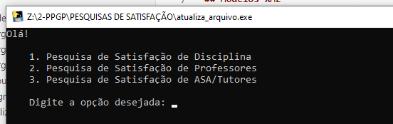
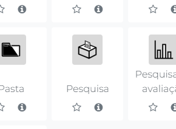
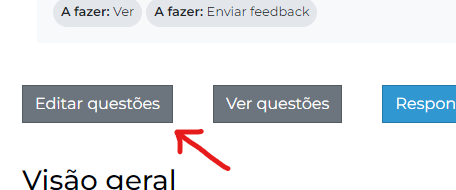
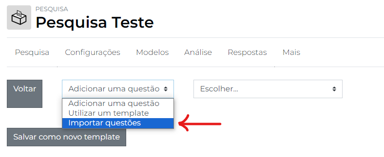
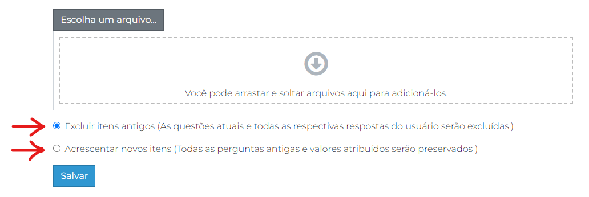

# Pesquisas de Satisfação

A utilização de arquivos XML para inserção de **pesquisas** no Moodle agiliza significativamente o processo de reutilização de questionários.

Os questionários do PPGP, em especial, possuem pequenas variações nos modelos utilizados, apenas de nome de disciplinas, professores e do tipo de tutor.

Segue um tutorial para utilização do programa `atualiza_arquivo.exe` presente neste repositório.

O programa original foi gerado em linguagem Python 3.11.9 convertida para executável através do uso da biblioteca PyInstaller.

Sinta-se livre para modificar o código para uma versão mais conveniente aos seus propósitos.

## Modelos XML

Os arquivos `ModeloDisciplina.xml`, `ModeloProfessor.xml` e `ModeloASA_SuporteDeOrientação.xml` estão prontos para serem publicados na plataforma, porém dependem da atualização de palavras chave, como NOME_PROFESSOR ou NOME_DISCIPLINA.

O programa `atualiza_arquivo.exe` tem por finalidade agilizar o processo de edição dos arquivos mencionados.

## Atualizando arquivos

Ao abrir o executável `atualiza_arquivo.exe` você verá um console com instruções para atualização. Utilize o **teclado numérico** para escolher a opção desejada e depois aperte `Enter`.

Ao final do procedimento, seu arquivo de saída poderá ser encontrado dentro da pasta `output`, no local onde o programa foi chamado.

## Publicando questionário

Para as pesquisas de satifação do PPGP, o recurso Moodle utilizado será a **Pesquisa**.

As configurações padrões do recurso já atendem ao modelo de pesquisa utilizado pelo PPGP, com respostas anônimas e sem possibilidade de múltiplas submissões. Basta modificar as **datas de disponibilidade** e os **critérios para conclusão da atividade**.

Feito isso, acesse à pesquisa para prosseguir com o cadastro do questionário. Clique em `Editar Questões`.

Em seguida, no menu de seleção, escolha `Importar questões`.

Você verá uma tela onde poderá fazer o upload do seu arquivo XML.

Repare que existem duas opções disponíveis para o tipo de cadastro realizado.

- Excluir itens antigos
- Acrescentar novos itens

Por padrão, você pode utilizar a primeira opção. Mas haverão casos em que será necessário utilizar a segunda. Mais especificamente, em situações de avaliação de múltiplos professores de uma mesma disciplina. Nesses casos, a orientação é de que, a partir do segundo docente, se utilize a opção **Acrescentar novos itens** para que o novo questionário seja concatenado ao questionário anterior.

Em caso de dúvidas, estou à disposição!

recursosmoodle@caed.ufjf.br